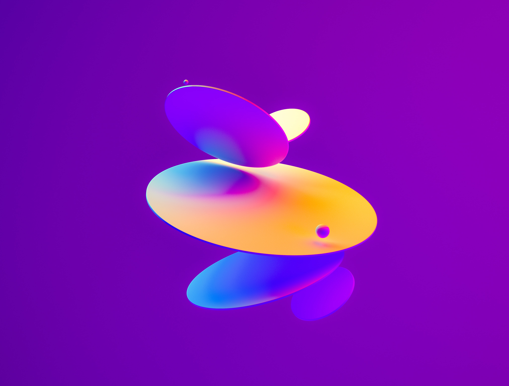
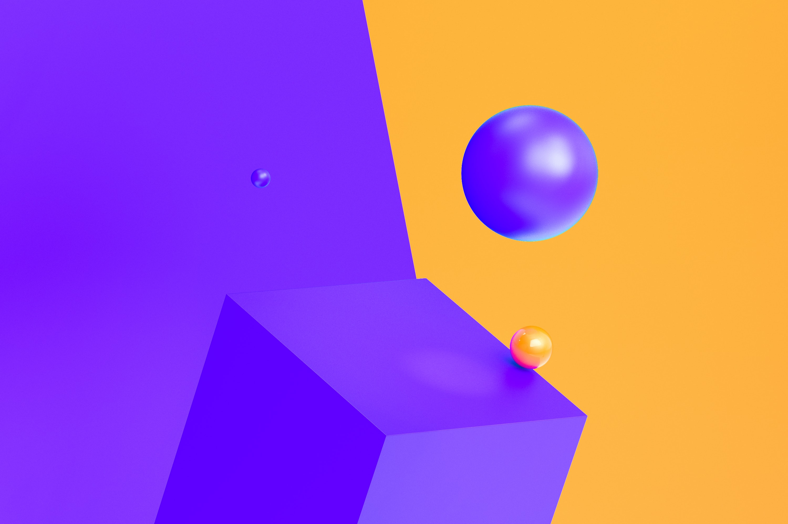

# Early-project
    <section id="RecentProjects" class="recent-projects">
      <h2>Recent    Projects</h2>
      

        <!--CARGADO POR js-->
          

        </article>
        <article class="project-card">
          <a class="project-wrapper" href="href="projects/1.html"> <!--ENLAZAR JS-->
          
          

            <h4>Dashcoin</h4>
            
Web Development

            Learn more
        </a>
          

        </article>
        <article class="project-card">
          <a class="project-wrapper" href="href="projects/1.html"> <!--ENLAZAR JS-->
          
          

            <h4>Vectorify</h4>
            
User Experience Design

            Learn more
        </a>
          

        </article>
      

    </section>